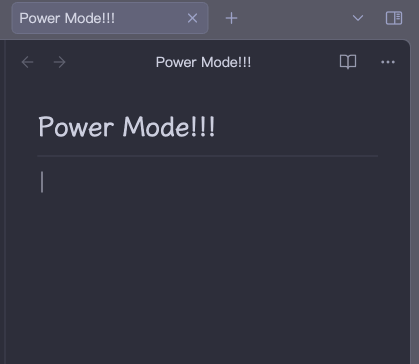
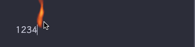

# Obsidian POWER MODE

 

## About

It's useless.

However, Writing can sometimes be a boring task. We need more passion and energy, and a little encouragement would also be great.

**Power Mode** might add that little bit of ceremony for you. Please enjoy.

Power Mode is not a new concept; it has been implemented numerous times in [various text editors](https://github.com/codeinthedark/awesome-power-mode) (for developers). Now, we can also activate Power Mode in Obsidian. The functionalities and effects of this project are significantly inspired by [vscode-power-mode](https://github.com/hoovercj/vscode-power-mode), for which I am immensely thankful. Additionally, some effects were inspired by shares from participants in [this issue](https://github.com/hoovercj/vscode-power-mode/issues/1), for which I also express gratitude (as mentioned in the code).

## Features

- Screen shaking
- Combo meter
- Many preset cursor explosion effects

### presets

| preset        | screenshot                              |
| ------------- | --------------------------------------- |
| particle      |  |
| flame         |        |
| rift          |          |
| magic         |         |
| firework      |      |
| emoji         |         |
| butterfly     |     |
| pikachu       |       |
| rainbow panda |          |
| sparkle       |       |
| rift          |          |
| lightning     |     |

## Installation

Search `power mode` in community plugins.
